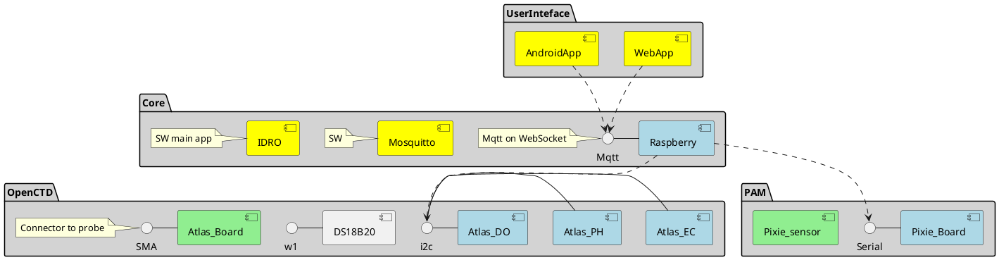
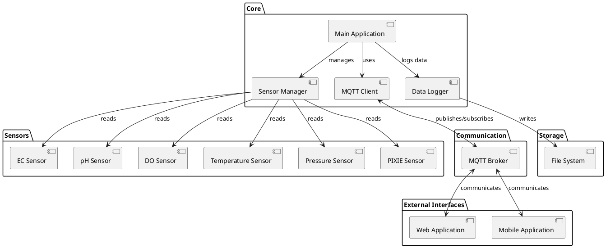

| Author            | Date       | Note                | Document version |
| ----------------- | ---------- | ------------------- | ---------------- |
| Luca Tricerri     | 01-05-2024 | Created             | 1.0              |
| Luca Tricerri     | 05-05-2024 | Updated             | 1.1              |
| Luca Tricerri     | 23-05-2024 | Updated             | 1.2              |
| Luca Tricerri     | 07-07-2024 | Updated             | 1.3              |
| Luca Tricerri     | 14-08-2024 | Updated             | 1.4              |
| Luca Tricerri     | 26-08-2024 | Updated             | 1.5              |
| Luca Tricerri     | 03-09-2024 | Updated             | 1.6              |
| Luca Tricerri     | 07-09-2024 | Updated             | 1.7              |
| Luca Tricerri     | 14-09-2024 | Updated             | 1.8              |
| Luca Tricerri     | 16-09-2024 | Updated             | 1.9              |
| Luca Tricerri     | 28-09-2024 | Updated             | 1.10             |
| Luca Tricerri     | 13-10-2024 | Updated             | 1.11             |
| Andrea De Camilli | 14-11-2024 | Updated             | 1.12             |
| Luca Tricerri     | 20-11-2024 | Updated             | 1.13             |
| Luca Tricerri     | 25-11-2024 | Updated             | 1.14             |
| Luca Tricerri     | 03-12-2024 | Updated             | 1.15             |
| Luca Tricerri     | 07-01-2025 | Syntax check        | 1.16             |
| Luca Tricerri     | 31-01-2025 | Updated             | 1.17             |
| Luca Tricerri     | 01-02-2025 | Updated calibration | 1.18             |
| Luca Tricerri     | 08-02-2025 | Updated             | 1.19             |
| Luca Tricerri     | 24-02-2025 | Updated             | 1.20             |
| Luca Tricerri     | 25-02-2025 | Updated             | 1.21             |
| Luca Tricerri     | 03-03-2025 | Updated             | 1.22             |

---

<!-- TOC -->

- [1. Glossary](#1-glossary)
- [2. Abstract](#2-abstract)
- [3. How to use the OceanPulse](#3-how-to-use-the-oceanpulse)
  - [3.1. Using the command line (Expert mode)](#31-using-the-command-line-expert-mode)
  - [3.2. Using the OceanPulse Realtime UI](#32-using-the-oceanpulse-realtime-ui)
    - [3.2.1. Up to version 1.17](#321-up-to-version-117)
    - [3.2.2. From version 1.18](#322-from-version-118)
    - [3.2.3. Calibrating Sensors](#323-calibrating-sensors)
    - [3.2.4. Monitoring Data](#324-monitoring-data)
    - [3.2.5. Managing Device Settings](#325-managing-device-settings)
- [4. General settings for OceanPulse](#4-general-settings-for-oceanpulse)
  - [4.1. Bill of materials (BOM)](#41-bill-of-materials-bom)
  - [4.2. Used OS](#42-used-os)
- [5. Creating SD card for Raspberry](#5-creating-sd-card-for-raspberry)
  - [5.1. Create the SD card](#51-create-the-sd-card)
  - [5.2. Prerequisites](#52-prerequisites)
  - [5.3. Config helper](#53-config-helper)
  - [5.4. Hostname](#54-hostname)
  - [5.5. DNS](#55-dns)
  - [5.6. Users and groups](#56-users-and-groups)
  - [5.7. Static Wired Address](#57-static-wired-address)
  - [5.8. WiFi Configuration](#58-wifi-configuration)
  - [5.9. Date Settings](#59-date-settings)
  - [5.10. SSH Key Configuration](#510-ssh-key-configuration)
- [6. Compilation](#6-compilation)
  - [6.1. X86](#61-x86)
  - [6.2. STM](#62-stm)
    - [6.2.1. Install toolchain](#621-install-toolchain)
    - [6.2.2. Install rootfs](#622-install-rootfs)
    - [6.2.3. Compile](#623-compile)
    - [6.2.4. Execute at startup](#624-execute-at-startup)
- [7. Filesystem](#7-filesystem)
- [8. OceanPulse PCB](#8-oceanpulse-pcb)
- [9. Mounting instructions](#9-mounting-instructions)
- [10. Mechanical](#10-mechanical)
- [11. Sensors](#11-sensors)
- [12. Communication via MQTT protocol](#12-communication-via-mqtt-protocol)
  - [12.1. PUBLISH and SUBSCRIBE](#121-publish-and-subscribe)
  - [12.2. Responses and Errors](#122-responses-and-errors)
  - [12.3. Password](#123-password)
  - [12.4. Mosquitto Helper](#124-mosquitto-helper)
- [13. Data Storage](#13-data-storage)
  - [13.1. Recover data from Raspberry](#131-recover-data-from-raspberry)
  - [13.2. Clear file system](#132-clear-file-system)
- [14. Bluetooth Configuration](#14-bluetooth-configuration)
  - [14.1. WiFi Configuration](#141-wifi-configuration)
  - [14.2. DHCP Server Configuration](#142-dhcp-server-configuration)
  - [14.3. Location Configuration](#143-location-configuration)
- [15. Configuration Files](#15-configuration-files)
  - [15.1. Boards](#151-boards)
  - [15.2. General](#152-general)
  - [15.3. Admin Tunnel](#153-admin-tunnel)
  - [15.4. MqttTunnel](#154-mqtttunnel)
  - [15.5. HttpTunnel](#155-httptunnel)
  - [15.6. Mqtt access](#156-mqtt-access)
- [16. Log](#16-log)
- [17. SSH access](#17-ssh-access)
- [18. Calibration procedure](#18-calibration-procedure)
  - [18.1. General](#181-general)
  - [18.2. EC](#182-ec)
  - [18.3. DO](#183-do)
  - [18.4. pH](#184-ph)
  - [18.5. Pixie](#185-pixie)
- [19. Architecture](#19-architecture)
  - [19.1. HW/SW Component architecture](#191-hwsw-component-architecture)
  - [19.2. Software Architecture](#192-software-architecture)
- [20. Raspberry pin-out](#20-raspberry-pin-out)
- [21. Serial helper](#21-serial-helper)
- [22. Remote tunnel helper](#22-remote-tunnel-helper)
- [23. SD CARD copy](#23-sd-card-copy)
- [24. Experimantal](#24-experimantal)
  - [24.1. Bluetooth](#241-bluetooth)
    - [24.1.1. bluetoothd](#2411-bluetoothd)
    - [24.1.2. obexpushd](#2412-obexpushd)
    - [24.1.3. Note](#2413-note)

<!-- /TOC -->

# 1. Glossary

| Abbreviation | Definition                          |
| ------------ | ----------------------------------- |
| BOM          | Bill of Materials                   |
| DNS          | Domain Name System                  |
| DO           | Dissolved Oxygen                    |
| EC           | Electrical Conductivity             |
| FTP          | File Transfer Protocol              |
| HW           | Hardware                            |
| I2C          | Inter-Integrated Circuit            |
| IMU          | Inertial Measurement Unit           |
| IP           | Internet Protocol                   |
| JSON         | JavaScript Object Notation          |
| MQTT         | Message Queuing Telemetry Transport |
| OS           | Operating System                    |
| PCB          | Printed Circuit Board               |
| PH           | Potential of Hydrogen               |
| SSH          | Secure Shell                        |
| STM          | ST Microelectronics                 |
| SW           | Software                            |
| TCP          | Transmission Control Protocol       |
| TDS          | Total Dissolved Solids              |
| UI           | User Interface                      |
| UML          | Unified Modeling Language           |
| USB          | Universal Serial Bus                |

# 2. Abstract

This project focuses on the development of a marine multisensor system capable of monitoring key parameters including Electrical Conductivity (EC), pH, Oxidation-Reduction Potential (ORP), and pressure. The system is designed to acquire, process, and transmit data to the surface for storage or visualization through a graphical interface.

The OceanPulse system represents a significant advancement in marine/freshwater environmental monitoring, offering real-time data collection and analysis capabilities that are crucial for understanding and preserving our oceans. By integrating multiple sensors into a single, robust platform, we enable comprehensive monitoring of water quality parameters that are essential indicators of marine ecosystem health.

# 3. How to use the OceanPulse

## 3.1. Using the command line (Expert mode)

To begin using the OceanPulse system, follow these steps to establish the initial connection:

1. Connect your PC and the OceanPulse device to a router with DHCP enabled using ethernet cables.

2. Power on the OceanPulse device by connecting the USB-C power cable.

3. Wait approximately 1 minute for the system to fully boot up.

4. The OceanPulse will automatically obtain an IP address from your router's DHCP server.

5. You can connect to the device in one of two ways:

    a. Using the hostname:

    ```bash
    ssh IDRO@IDRO.local
    ```

    b. Using the IP address (if hostname resolution doesn't work):

    - Find the IP address assigned to OceanPulse from your router's DHCP client list
    - Connect using:

    ```bash
    ssh IDRO@<ip_address>
    ```

    In both cases, the default password is `IDRO`.

## 3.2. Using the OceanPulse Realtime UI

To use the OceanPulse Realtime UI, follow these steps:

### 3.2.1. Up to version 1.17

1. Unzip the `ui-Oceanpulse.zip` file.
2. Open the Chrome browser on your PC.
3. Drag and drop the `ui.html` file into the browser.
4. Enter the IP address of the OceanPulse device in the input field (or `IDRO.local` if you are on the same network and using the hostname).
5. Use port `8181`.
6. Click "Connect."
7. The OceanPulse Realtime UI will load, displaying real-time data from the connected sensors.
8. Use the UI to monitor sensor readings, saves, calibrate sensors, and manage device settings.

### 3.2.2. From version 1.18

From OceanPulse version 1.18 the UI is `ALSO` available at `http://<ip_address>:8181/index.html`

1. Open the Chrome browser on your PC.
2. Go to `http://<ip_address>:8181/index.html`
3. Enter the IP address of the OceanPulse device in the input field (or `IDRO.local`).
4. Use port `8181`.
5. Click "Connect."
6. The OceanPulse Realtime UI will load, displaying real-time data from the connected sensors.
7. Use the UI to monitor sensor readings, saves, calibrate sensors, and manage device settings.

**Important notes** about saving data from the UI:

-   The data is temporarily saved in the browser, so you must save it before closing the browser. Do not refresh the page before saving data.
-   Once the Save button is pressed, the data is downloaded from the browser and saved in your Downloads folder.

### 3.2.3. Calibrating Sensors

The OceanPulse Realtime UI allows you to calibrate various sensors (DO, EC, PH). Follow the instructions in the "Calibrating Sensors" section of the user manual for detailed steps.

### 3.2.4. Monitoring Data

The UI provides real-time graphs and data displays for all connected sensors.

### 3.2.5. Managing Device Settings

Two button are available:

-   **Reboot**
-   **Clear** (data and logs)

# 4. General settings for OceanPulse

## 4.1. Bill of materials (BOM)

| Component                        | Quantity | Notes                          |
| -------------------------------- | -------- | ------------------------------ |
| Raspberry 4B with 4GB RAM        | 1        | Main processing unit           |
| SD card 16 GB                    | 1        | Storage for OS and data        |
| OceanPulse PCB                   | 1        | Custom-designed circuit board  |
| Waterproof enclosure             | 1        | For underwater protection      |
| Power bank                       | 1        | Portable power source          |
| Router with 2 LAN ports          | 1        | Network connectivity           |
| Atlas Scientific i3 InterLink    | 2        | Sensor interface modules       |
| Atlas Scientific EC sensor board | 1        | Electrical Conductivity sensor |
| Atlas Scientific PH sensor board | 1        | pH sensor                      |
| Atlas Scientific DO sensor board | 1        | Dissolved Oxygen sensor        |
| Pressure sensor board            | 1        | MS5803-14BA pressure sensor    |
| PIXIE sensor system              | 1        | Fluorimeter for water analysis |
| DS18B20 temperature sensor       | 3        | Digital temperature sensors    |
| BNO055 tilt sensor               | 1        | Adafruit BNO055 9-DOF          |
| AS7341 spectral light sensor     | 1        | Adafruit AS7341 11-channel     |
| EC probe                         | 1        | Conductivity measurement       |
| PH probe                         | 1        | pH measurement                 |
| DO probe                         | 1        | Dissolved oxygen measurement   |
| USB-C cable                      | 1        |                                |
| Cables                           | TBD      | Quantity to be determined      |
| EDG 5.08 mm 4 pins male          | 2        |                                |
| EDG 5.08 mm 4 pins female        | 2        |                                |
| EDG 5.08 mm 3 pins male          | 1        |                                |
| EDG 5.08 mm 3 pins female        | 1        |                                |
| EDG 5.08 mm 2 pins male          | 1        |                                |
| EDG 5.08 mm 2 pins female        | 1        |                                |
| 4.7 KΩ resistor               | 1        |                                |
| OceanPulse PCB version 1.6       | 1        | Gerber are available           |

## 4.2. Used OS

Raspberry Pi OS Lite (32-bit) on Raspberry 4B
[Raspberry OS](https://www.raspberrypi.com/software/operating-systems/)

You can directly use the OceanPulse pre-created SD card. In this case, skip the sections up to [section 8.0 (OceanPulse PCB)](#8-oceanpulse-pcb).

The Raspberry Pi OS Lite is chosen for its lightweight nature, which is ideal for our headless operation and maximizes system resources for data collection and processing.

# 5. Creating SD card for Raspberry

A basic knowledge of Linux system is required for this section.

## 5.1. Create the SD card

1. Download the Raspberry Pi Imager from [https://www.raspberrypi.com/software/](https://www.raspberrypi.com/software/)
2. Install and launch the Raspberry Pi Imager (this operation can be accomplished on any system that supports the Raspberry Pi Imager)
3. Click "Choose OS" and select "Raspberry Pi OS (32-bit)"
4. Click "Choose Storage" and select your SD card
5. Click "Write" to begin the installation process

## 5.2. Prerequisites

Power on the Raspberry Pi and connect it to your router using an Ethernet cable. The Raspberry Pi will automatically obtain a DHCP address. Check your router to find the IP address assigned to the Raspberry Pi.

To access the Raspberry Pi remotely, use SSH with the following command:

```bash
ssh pi@<board IP address>
```

The default password is `raspberry`.

Next, update the package list and upgrade all installed packages:

```bash
sudo apt update && sudo apt full-upgrade
```

Install the required packages:

```bash
sudo apt install libxml2-utils autossh screen libboost-dev mosquitto htop cmake git i2c-tools jq libx11-dev libxkbfile-dev libsecret-1-dev gdbserver avahi-daemon lighttpd isc-dhcp-server
```

Enable and start the Avahi daemon service:

```bash
sudo systemctl enable avahi-daemon
sudo systemctl start avahi-daemon
```

Disable the Mosquitto service:

```bash
sudo systemctl disable mosquitto
```

## 5.3. Config helper

For configuration, use:

```bash
sudo rpi-config
```

-   Activate i2c and w1
-   Configure wifi (optional)
-   Set hostname to IDRO
-   Activate ssh access

## 5.4. Hostname

If needed (for some reason the previous operation failed) manual change hostname to `IDRO`:

Open and change these files using `sudo`:

```bash
/etc/hostname
/etc/hosts
```

## 5.5. DNS

DNS can have problems on the local network and the IDRO.local address may not work.
Make sure that the avahi-daemon service is running to enable the DNS resolution of the IDRO.local hostname:

```bash
sudo systemctl start avahi-daemon
```

We suggest forcing the hostname to IDRO:
Change the configuration file (/etc/avahi/avahi-daemon.conf) by adding the following parameter:

```bash
host-name=IDRO
```

## 5.6. Users and groups

Add user IDRO:

```bash
sudo useradd -m -G sudo,video,netdev,gpio,i2c,input,admin IDRO
sudo passwd IDRO
<IDRO>
sudo passwd
<IDRO>

sudo chmod -R 775 /var/www/html
```

In this case we suggest to use the same password for IDRO and root.

At the end you will have these users:

```
usr: IDRO
pwd: IDRO

user: root
pwd: IDRO
```

`Important note`:the applications and script are started `form root`.

## 5.7. Static Wired Address

To set up a static wired IP address, connect via SSH and use:

`sudo nmtui`

Follow the steps shown in the images:


Note that after configuration, the Raspberry Pi will only be accessible through the selected address on a wired connection.

## 5.8. WiFi Configuration

WiFi can be configured using either `nmtui` or `raspi-config`.

To use `raspi-config`, run:

`sudo raspi-config`

Follow the steps shown in the images:


Then, set your SSID and password.

## 5.9. Date Settings

In the file `/etc/default/locale`, add the following line:

```bash
LC_TIME="C.UTF-8"
```

## 5.10. SSH Key Configuration

Create an SSH key and copy it to IDRO:

For Linux users:

```bash
ssh-keygen
ssh-copy-id IDRO@IDRO.local
```

For Windows users you can use putty application.

# 6. Compilation

A advanced knowledge of Linux system and c++ programming language is required for this section.

Clone the OceanPulse repository:

```bash
git clone https://github.com/triccyx/OceanPulse
```

## 6.1. X86

Compilation on X86 host is for debugging purpose

```bash
cd OceanPulse
mkdir build
cd build
cmake -DX86=ON -DCMAKE_BUILD_TYPE=Debug -DCMAKE_INSTALL_PREFIX=<your install folder> ..
make install
```

## 6.2. STM

We will execute a cross-compilation.

### 6.2.1. Install toolchain

From https://github.com/Pro/raspi-toolchain `Releases` button, download `raspi-toolchain.tar.gz`


Untar and copy Raspberry toolchain in `./OceanPulse/cross-pi-gcc`.

```bash
tar -xzvf raspi-toolchain.tar.gz
cp -r raspi-toolchain ./OceanPulse/cross-pi-gcc
```

### 6.2.2. Install rootfs

Copy from Raspberry the rootfs. Insert the Raspberry SDCARD in the PC and run:

```bash
rsync -vR --progress -rl --delete-after --safe-links IDRO@IDRO.local:/{lib,usr,etc/ld.so.conf.d,opt/vc/lib} ./OceanPulse/rootfs
```

### 6.2.3. Compile

```bash
cd OceanPulse
mkdir build
cd build
cmake -DX86=OFF -DCMAKE_BUILD_TYPE=Debug ..
make install
make DeployToBox
```

### 6.2.4. Execute at startup

Add to /etc/rc.local using sudo.

```bash
cd /home/IDRO
./runIdro.sh
```

# 7. Filesystem

```
+-- home/IDRO
 +-- IDRO
 +-- runidro.sh
 +-- script
 |   +-- idromosquitto.sh
 |   +-- mqtttunnel.sh
 |   +-- mqttwstunnel.sh
 |   +-- wifireconnector.sh
 |   +-- admintunnel.sh
 +-- configuration
 +-- boardconfig.json
 +-- logconfig.json
 +-- mosquittoserver
 +-- idro.conf
 +-- pwd.txt
 +-- log
 +-- archive
 +-- data

```

# 8. OceanPulse PCB

The Gerber files for the OceanPulse PCB board version 1.3 are available in the repository.
`HW` folder.

# 9. Mounting instructions

Mounting steps:

-   Start with a naked Raspberry Pi.
    {width=500px}
-   Insert the SD card
-   Mount two Atlas Scientific i3 InterLink boards over the naked Raspberry Pi. And the small DO/PH/EC boards. Use only the `isolated slot` (number 1 or 2)
    {width=500px}
-   Mount the OceanPulse PCB over the i3 InterLink boards.
    {width=500px}
-   Connect the STM cable.
-   Connect the temperature cables.
-   Connect the pressure sensor cable.
-   Connect the light meter sensor cable.
    {width=500px}

# 10. Mechanical

**Support for Raspberry Pi and HAT Boards**
The Raspberry Pi and its three HAT boards are supported by a 3D-printed structure (refer to attached photos). This structure is designed to hold the Raspberry Pi vertically, with USB cables running along the enclosure's cylinder. The 3D-printed structure facilitates easy installation and removal of components.

**Watertight Enclosure Tube**
The primary enclosure is an aluminium watertight tube with a diameter of 130 mm and a length of 300 mm (model BR-101409-300 from Bluerobotics). This tube, featuring precision-machined O-ring interfaces, a locking cord, and an anti-rotation feature, is rated for depths up to 950 meters. Each end of the tube is sealed with end caps from Bluerobotics, providing a reliable seal and allowing for the connection of various cables and connectors needed for external sensors.

**WetLink Penetrators**
To route sensor cables from the Raspberry Pi to the exterior, various WetLink penetrators are used (models BR-100870-155 and BR-100870-345). These penetrators are installed on the enclosure's end caps, ensuring a watertight connection for cables leading to the external sealed sensors.

**Assembly**
Component Mounting: The Raspberry Pi and HAT boards are mounted on the 3D-printed support, which is then slid into the watertight tube, fitting snugly.
Cable Connections: Sensor cables are routed through the WetLink Penetrators, and secured to the tube's end caps. These penetrators were selected for their ability to maintain a watertight seal, crucial for safe system operation in a marine environment.
Sealing and Closing: After closing and tightening the end caps, a vacuum pump is used to create a vacuum inside the enclosure. The pressure is reduced by approximately 15 inHg and monitored for 15-20 minutes to ensure the vacuum remains stable.

{width=500px}
{width=500px}
{width=500px}

The 3D printer-ready file is in the `Mechanics` folder.

# 11. Sensors

| Sensor name  | Type             | Version                  | Bus    | Note       |
| ------------ | ---------------- | ------------------------ | ------ | ---------- |
| DO           | Atlas scientific | v.5.6                    | i2c    |            |
| PH           | Atlas scientific | v.6.1                    | i2c    |            |
| EC           | Atlas scientific | v.6.5                    | i2c    |            |
| Pressure     | MS5803-14BA      | na                       | i2c    |            |
| Temperature  | DS18B20          | na                       | w1     |            |
| PIXIE        | Fluorimiter      | hv:0.80 fv:0.80 sn:00000 | serial |            |
| AS7341       | Spectral Sensor  | na                       | i2c    | 11-Channel |
| BNO055       | IMU              | v1.0                     | i2c    |            |
| Spectrometer | AS7341           | na                       | i2c    | 8 Channel  |

Note: This table provides an overview of the sensors used in the system, including their names, types, versions (where applicable), and the bus they communicate on.

# 12. Communication via MQTT protocol

The communication with external systems is achieved using the MQTT (Message Queuing Telemetry Transport) protocol.
This protocol supports two transport methods: WebSocket and TCP (Transmission Control Protocol).
Both WebSocket and TCP can be utilized simultaneously for enhanced flexibility and redundancy.
MQTT enables efficient, lightweight messaging between the OceanPulse system and external clients or servers.
This dual-protocol approach ensures robust connectivity across various network environments and client capabilities.

In simpler terms, MQTT is like a postal service for the OceanPulse box. It helps the box send and receive messages to and from other devices or systems. By using two different ways to send these messages (WebSocket and TCP), we make sure that the OceanPulse box can always stay connected, no matter what kind of network it's on. **This means you can easily control and configure the OceanPulse box** from anywhere, even if you're not a tech expert.

| Param name      | Default value | Note                               | Network type    |
| --------------- | ------------- | ---------------------------------- | --------------- |
| Webssocket port | 8081          | Can be changer in boardconfig.json | Lan access only |
| Tcp port        | 1883          | Can be changer in boardconfig.json | Lan access only |
| Box name        | Box1          | Can be changer in boardconfig.json |                 |

## 12.1. PUBLISH and SUBSCRIBE

The box `PUBLISH` over:

| Topic                           | Carried data           | Value                                             | Additional value\*             | UOM       |
| ------------------------------- | ---------------------- | ------------------------------------------------- | ------------------------------ | --------- |
| \<BoxName\>/EC/EC               | conductivity           | {"value":\<value\>,"timestamp":"\<time\>"}        | info,testid,latitude,longitude | μS/cm  |
| \<BoxName\>/EC/TDS              | Total dissolved solids | {"value":\<value\>,"timestamp":"\<time\>"}        | info,testid,latitude,longitude | ppm       |
| \<BoxName\>/EC/S                | salinity               | {"value":\<value\>,"timestamp":"\<time\>"}        | info,testid,latitude,longitude | PSU (ppt) |
| \<BoxName\>/EC/SG               | specific gravity       | {"value":\<value\>,"timestamp":"\<time\>"}        | info,testid,latitude,longitude | none      |
| \<BoxName\>/Temperature         | temperture             | {"value":\<value\>,"timestamp":"\<time\>"}        | info,testid,latitude,longitude | C         |
| \<BoxName\>/PH                  | PH                     | {"value":\<value\>,"timestamp":"\<time\>"}        | info,testid,latitude,longitude | none      |
| \<BoxName\>/DO/mg               | mg                     | {"value":\<value\>,"timestamp":"\<time\>"}        | info,testid,latitude,longitude | mg/l      |
| \<BoxName\>/DO/perc             | perc                   | {"value":\<value\>,"timestamp":"\<time\>"}        | info,testid,latitude,longitude | %         |
| \<BoxName\>/PRESSURE/pressure   | pressure               | {"value":\<value\>,"timestamp":"\<time\>"}        | info,testid,latitude,longitude | millibar  |
| \<BoxName\>/PRESSURE/temp       | temperture             | {"value":\<value\>,"timestamp":"\<time\>"}        | info,testid,latitude,longitude | C         |
| \<BoxName\>/PIXIE/channel1      | channel1               | {"value":\<value\>,"timestamp":"\<time\>"}        | info,testid,latitude,longitude |           |
| \<BoxName\>/PIXIE/channel2      | channel2               | {"value":\<value\>,"timestamp":"\<time\>"}        | info,testid,latitude,longitude |           |
| \<BoxName\>/PIXIE/channel3      | channel3               | {"value":\<value\>,"timestamp":"\<time\>"}        | info,testid,latitude,longitude |           |
| \<BoxName\>/PIXIE/channel4      | channel4               | {"value":\<value\>,"timestamp":"\<time\>"}        | info,testid,latitude,longitude |           |
| \<BoxName\>/InternalTemperature | temperture             | {"value":\<value\>,"timestamp":"\<time\>"}        | info,testid,latitude,longitude | C         |
| \<BoxName\>/SPECTROMETER/ch1    | channel1               | {"value":\<value\>,"timestamp":"\<time\>"}        | info,testid,latitude,longitude |           |
| \<BoxName\>/SPECTROMETER/ch2    | channel2               | {"value":\<value\>,"timestamp":"\<time\>"}        | info,testid,latitude,longitude |           |
| \<BoxName\>/SPECTROMETER/ch3    | channel3               | {"value":\<value\>,"timestamp":"\<time\>"}        | info,testid,latitude,longitude |           |
| \<BoxName\>/SPECTROMETER/ch4    | channel4               | {"value":\<value\>,"timestamp":"\<time\>"}        | info,testid,latitude,longitude |           |
| \<BoxName\>/SPECTROMETER/ch5    | channel5               | {"value":\<value\>,"timestamp":"\<time\>"}        | info,testid,latitude,longitude |           |
| \<BoxName\>/SPECTROMETER/ch6    | channel6               | {"value":\<value\>,"timestamp":"\<time\>"}        | info,testid,latitude,longitude |           |
| \<BoxName\>/SPECTROMETER/ch7    | channel7               | {"value":\<value\>,"timestamp":"\<time\>"}        | info,testid,latitude,longitude |           |
| \<BoxName\>/SPECTROMETER/ch8    | channel8               | {"value":\<value\>,"timestamp":"\<time\>"}        | info,testid,latitude,longitude |           |
| \<BoxName\>/SPECTROMETER/clear  | clear                  | {"value":\<value\>,"timestamp":"\<time\>"}        | info,testid,latitude,longitude |           |
| \<BoxName\>/SPECTROMETER/nir    | nir                    | {"value":\<value\>,"timestamp":"\<time\>"}        | info,testid,latitude,longitude |           |
| \<BoxName\>/IMU/pitch           | nir                    | {"value":\<value\>,"timestamp":"\<time\>"}        | info,testid,latitude,longitude | deg       |
| \<BoxName\>/IMU/roll            | nir                    | {"value":\<value\>,"timestamp":"\<time\>"}        | info,testid,latitude,longitude | deg       |
| \<BoxName\>/Response            | Response msg           | {"value":"<error string>","timestamp":"\<time\>"} | info,testid,latitude,longitude |           |

\*Additional values are sent only if ShortMessage is false

The box `SUBSCRIBE` over:

| Topic               | Value                                                                                                                   | Note                             |
| ------------------- | ----------------------------------------------------------------------------------------------------------------------- | -------------------------------- |
| \<BoxName\>/command | {"msgid":\<msgid\>,"type":"start","value":true}                                                                         | Start acquisition                |
| \<BoxName\>/command | {"msgid":\<msgid\>,"type":"start","value":false}                                                                        | Stop acquisition                 |
| \<BoxName\>/command | {"msgid":\<msgid\>,"type":"calibrate","boardsensortype":"EC","calibrationtype":"dry"}                                   | Calib dry                        |
| \<BoxName\>/command | {"msgid":\<msgid\>,"type":"calibrate","boardsensortype":"EC","value":\<EC value\>,"calibrationtype":"single"}           | Calib single                     |
| \<BoxName\>/command | {"msgid":\<msgid\>,"type":"calibrate","boardsensortype":"EC","value":\<EC value\>,"calibrationtype":"low"}              | Calib low                        |
| \<BoxName\>/command | {"msgid":\<msgid\>,"type":"calibrate","boardsensortype":"EC","value":\<EC value\>,"calibrationtype":"high"}             | Calib high                       |
| \<BoxName\>/command | {"msgid":\<msgid\>,"type":"calibrate","boardsensortype":"PH","value":\<PH value\>,"calibrationtype":"mid"}              | Calib mid                        |
| \<BoxName\>/command | {"msgid":\<msgid\>,"type":"calibrate","boardsensortype":"PH","value":\<PH value\>,"calibrationtype":"low"}              | Calib low                        |
| \<BoxName\>/command | {"msgid":\<msgid\>,"type":"calibrate","boardsensortype":"PH","value":\<PH value\>,"calibrationtype":"high"}             | Calib high                       |
| \<BoxName\>/command | {"msgid":\<msgid\>,"type":"calibrate","boardsensortype":"DO","calibrationtype":"atm"}                                   | Calib atm oxygen levels          |
| \<BoxName\>/command | {"msgid":\<msgid\>,"type":"calibrate","boardsensortype":"DO","calibrationtype":"zero"}                                  | Calib 0 dissolved oxygen         |
| \<BoxName\>/command | {"msgid":\<msgid\>,"type":"calibrate","boardsensortype":"PIXIE","value":\<PH value\>,"calibrationtype":"SGAIN1"}        | Can be 1,2,4,8,16 on ch1         |
| \<BoxName\>/command | {"msgid":\<msgid\>,"type":"calibrate","boardsensortype":"PIXIE","value":\<PH value\>,"calibrationtype":"SGAIN2"}        | Can be 1,2,4,8,16 on ch2         |
| \<BoxName\>/command | {"msgid":\<msgid\>,"type":"calibrate","boardsensortype":"PIXIE","value":\<PH value\>,"calibrationtype":"SGAIN3"}        | Can be 1,2,4,8,16 on ch3         |
| \<BoxName\>/command | {"msgid":\<msgid\>,"type":"calibrate","boardsensortype":"PIXIE","value":\<PH value\>,"calibrationtype":"SGAIN4"}        | Can be 1,2,4,8,16 on ch4         |
| \<BoxName\>/command | {"msgid":\<msgid\>,"type":"calibrate","boardsensortype":"PIXIE","value":\<PH value\>,"calibrationtype":"SPGAIN1"}       | Can be 1,2,5,10,20,50,100 on ch1 |
| \<BoxName\>/command | {"msgid":\<msgid\>,"type":"calibrate","boardsensortype":"PIXIE","value":\<PH value\>,"calibrationtype":"SPGAIN2"}       | Can be 1,2,5,10,20,50,100 on ch2 |
| \<BoxName\>/command | {"msgid":\<msgid\>,"type":"calibrate","boardsensortype":"PIXIE","value":\<PH value\>,"calibrationtype":"SPGAIN3"}       | Can be 1,2,5,10,20,50,100 on ch3 |
| \<BoxName\>/command | {"msgid":\<msgid\>,"type":"calibrate","boardsensortype":"PIXIE","value":\<PH value\>,"calibrationtype":"SPGAIN4"}       | Can be 1,2,5,10,20,50,100 on ch4 |
| \<BoxName\>/command | {"msgid":\<msgid\>,"type":"calibrate","boardsensortype":"PIXIE","value":\<PH value\>,"calibrationtype":"SATTEN1"}       | Can be 0,1,2,3 on ch1            |
| \<BoxName\>/command | {"msgid":\<msgid\>,"type":"calibrate","boardsensortype":"PIXIE","value":\<PH value\>,"calibrationtype":"SATTEN2"}       | Can be 0,1,2,3 on ch2            |
| \<BoxName\>/command | {"msgid":\<msgid\>,"type":"calibrate","boardsensortype":"PIXIE","value":\<PH value\>,"calibrationtype":"SATTEN3"}       | Can be 0,1,2,3 on ch3            |
| \<BoxName\>/command | {"msgid":\<msgid\>,"type":"calibrate","boardsensortype":"PIXIE","value":\<PH value\>,"calibrationtype":"SATTEN4"}       | Can be 0,1,2,3 on ch4            |
| \<BoxName\>/command | {"msgid":\<msgid\>,"type":"calibrate","boardsensortype":"PRESSURE","value":\<offset value\>,"calibrationtype":"offset"} | Pressure offset                  |
| \<BoxName\>/command | {"msgid":\<msgid\>,"type":"clear"}                                                                                      | Clear data folder                |
| \<BoxName\>/command | {"msgid":\<msgid\>,"type":"reboot"}                                                                                     | Reboot                           |
| \<BoxName\>/command | {"msgid":\<msgid\>,"type":"status"}                                                                                     | Retrieve status                  |
| \<BoxName\>/command | {"msgid":\<msgid\>,"type":"version"}                                                                                    | Retrieve version info            |
| \<BoxName\>/command | {"msgid":\<msgid\>,"type":"address"}                                                                                    | Retrieve IP address              |
| \<BoxName\>/command | {"msgid":\<msgid\>,"type":"serial"}                                                                                     | Retrieve serial number info      |
| \<BoxName\>/command | {"msgid":\<msgid\>,"type":"diskusage"}                                                                                  | Retrieve disk usage info         |
| \<BoxName\>/command | {"msgid":\<msgid\>,"type":"changesettings","name":"","value":""}                                                        | Change setting\* and save        |
| \<BoxName\>/command | {"msgid":\<msgid\>,"type":"changeboardstatus","boardsensortype":"","value":""}                                          | Change board Active              |

\* Available settings: `BoxId, TestId,Latitude, Longitude, SamplingTimeInMsec, AutoStart,PublishEqualValues, ShortMessage,TemperatureCorrection, EnableDataWriting`

Note:
`msgid` is the msg identifier, it is inserted in the answer. It should be incremental. Can not be 0

## 12.2. Responses and Errors

The OceanPulse system provides responses and error messages to communicate the status of operations and any issues that may arise during its operation. These messages are crucial for monitoring the system's health, troubleshooting problems, and ensuring proper functionality.

Responses and error messages are published on the MQTT topic `<BoxName>/Response`, where `<BoxName>` is the unique identifier for the OceanPulse device. This allows for easy integration with monitoring systems and user interfaces.

The messages are formatted as JSON objects, containing the following fields:

-   `msgid`: A unique identifier for the message, corresponding to the command that triggered the response.
-   `value`: A numeric code indicating the type of response or error.
-   `timestamp`: The date and time when the message was generated, in the format "DD-MM-YYYY_HH:MM:SS.mmm".
-   `info`: Additional information about the response or error (if applicable).
-   `testId`: The current test identifier.
-   `latitude` and `longitude`: The geographical coordinates of the device.

Available on topics:
`<BoxName>/Response`

Format:
`{"msgid":<id>,"value":<code>,"timestamp":"22-08-2024_22:03:46.948","info":"","testId":"Test1","latitude":44.4056,"longitude":8.9463}`

| Code | Description                        | Type  |
| ---- | ---------------------------------- | ----- |
| 0    | Calibrate only in stop state       | Error |
| 1    | Clear only in stop state           | Error |
| 2    | Unknown command `type` in msg      | Error |
| 3    | Wrong calibration param in msg     | Error |
| 4    | Wrong json syntax                  | Error |
| 5    | Command ok                         | Info  |
| 6    | Missing `msgid` from msg           | Error |
| 7    | Missing `type` from msg            | Error |
| 8    | Missing `boardsensortype` from msg | Error |
| 9    | Missing `calibrationtype` from msg | Error |
| 10   | Missing `value` from msg           | Error |
| 11   | File error                         | Error |
| 12   | Missing `name` from msg            | Error |
| 13   | Status active                      | Info  |
| 14   | Status not active                  | Info  |
| 15   | Version                            | Info  |
| 16   | Cpu overheat                       | Error |
| 17   | I2C bus error                      | Error |
| 18   | Read error (i2c/w1/Serial)         | Error |

Note:
`msgid` is the msg identifier, it is inserted in the incoming msg. It should be incremental. . Can not be 0

## 12.3. Password

No password is configured

## 12.4. Mosquitto Helper

Some bash commands for test the system from a Linux host system:

Publish commands to the Box:

```bash
mosquitto_pub -h <Box ip address>  -t Box1/command/ -m '{"msgid":1,"type":"calibrate","boardsensortype":"EC","value":34,"calibrationtype":"dry"}' -p 1883
mosquitto_pub -h <Box ip address>  -t Box1/command/ -m '{"msgid":1,"type":"start","value":true}' -p 1883
```

Subscribe to the Box:

```bash
mosquitto_sub -h <Box ip address>  -t "Box1/#"  -p 1883
```

# 13. Data Storage

The system uses a FilePublisher class to store sensor data locally. Key features include:

-   Data is stored in a "./data" directory
-   Each sensor type can have its own file
-   Data format: "<timestamp> <sensor_data>"
-   Automatically creates the data directory if it doesn't exist
-   Appends new data to existing files

## 13.1. Recover data from Raspberry

To recover the data, you can use the **FileZilla** application. FileZilla is a free and open-source FTP client that allows you to transfer files between your local computer and a remote server. By connecting to the device running the OceanPulse system, you can navigate to the "./data" directory and download the stored sensor data files to your local machine for further analysis or backup.

**Configuration**:
host:IDRO.local
user:root
pwd:IDRO
Protocol:Sftp
folder:/home/IDRO/data

## 13.2. Clear file system

To clear the file system, you can use the **FileZilla** application to connect to the device and manually delete the files in the "./data" directory. Follow these steps:

1. Open FileZilla and connect to the device using the following configuration:

    - Host: IDRO.local
    - User: root
    - Password: IDRO
    - Protocol: SFTP
    - Folder: /home/IDRO/data

2. Navigate to the "./data" directory and clear files
3. Navigate to the "./archive" directory and clear files
4. Navigate to the "./log" directory and clear files

# 14. Bluetooth Configuration

Through the Bluetooth configuration interface, it is possible to configure:

-   WiFi network settings
-   DHCP server settings
-   Device location (latitude and longitude)

## 14.1. WiFi Configuration

The Bluetooth interface allows configuring the WiFi connection to connect to a specific access point.

-   Connect and pair to IDRO on bluethoot
-   Send a file with the following format:

```
country=IT
ctrl_interface=DIR=/var/run/wpa_supplicant GROUP=netdev
ap_scan=1

update_config=0
network={
        ssid="xxx"
        psk="xxx"
}
```

-FIle name is wpa_supplicant.conf

## 14.2. DHCP Server Configuration

TODO

## 14.3. Location Configuration

TODO

# 15. Configuration Files

The OceanPulse system uses configuration files to manage various settings and parameters. These files allow for easy customization and adjustment of the system's behavior without modifying the source code. The main configuration file is located at:

`./configuration/boardconfig.json`

This JSON file contains settings for individual sensor boards, general system parameters, and MQTT connection details. Below is an overview of the main sections and their key configuration options:

## 15.1. Boards

| Name                | Default | Values                                                             | Used in boards                     | Note                               |
| ------------------- | ------- | ------------------------------------------------------------------ | ---------------------------------- | ---------------------------------- |
| BoardType           |         | EC/TERMO/PH/DO/PIXIE/PRESSURE/IMU/SPECTROMETER/INTERNALTEMPERATURE | All                                | Specifies the type of sensor board |
| BoardAddress        |         |                                                                    | EC/PH/DO/PRESSURE/IMU/SPECTROMETER | I2C address or other identifier    |
| Active              | false   | boolean                                                            | All                                | Enables/disables the board         |
| ProbeType           | 1       | 10/1/0.1                                                           | EC                                 | Specific to EC probes              |
| TemperatureSupplier |         | boolean                                                            |                                    | Can supply temperature             |
| TemperatureNeed     |         | boolean                                                            |                                    | Need temperature for correct work  |

Note: These configuration options define the characteristics and behavior of each sensor board in the system. Ensure each board is properly configured for optimal performance.

## 15.2. General

| Name                  | Default | Values  | Used in boards | Note                                                                                       |
| --------------------- | ------- | ------- | -------------- | ------------------------------------------------------------------------------------------ |
| BoxId                 | Box1    | string  | All            | Unique identifier for the device                                                           |
| TestId                | Test1   | string  | All            | Identifier for the current test                                                            |
| SerialNumber          | 100     | integer | All            | Unique code for the box                                                                    |
| Latitude              | 0       | float   | All            | Geographic latitude of the device                                                          |
| Longitude             | 0       | float   | All            | Geographic longitude of the device                                                         |
| i2cBusAddress         | 0x1     | hex     | EC/PH/DO       | I2C bus address for specific sensors                                                       |
| SamplingTimeInMsec    | 2000    | integer | All            | Time between sensor readings in ms                                                         |
| AutoStart             | true    | boolean | All            | Whether to start readings automatically                                                    |
| PublishEqualValues    | true    | boolean | All            | Publish even if same as previous value                                                     |
| ShortMessage          | false   | boolean | All            | Remove additional data from mqtt message                                                   |
| TemperatureCorrection | false   | boolean | All            | Apply temperature correction to sensor, if true can cause delay and error on Atlas sensors |
| EnableDataWriting     | true    | boolean | All            | Enable or disable data writing to file system                                              |

## 15.3. Admin Tunnel

| Name       | Default                | Note                        |
| ---------- | ---------------------- | --------------------------- |
| AdminPort  | 10020                  | Port for admin tunnel       |
| TunnelExit | www.saltwatercloud.com | Remote server for tunneling |
| TunnelUsr  | ubuntu                 | Username for tunnel access  |

Note that all boards have the same admin tunnel configuration.

## 15.4. MqttTunnel

| Name             | Default                | Note                        |
| ---------------- | ---------------------- | --------------------------- |
| MqttTunnelPort   | 10021                  | Port for MQTT tunnel        |
| MqttWsTunnelPort | 10022                  | Port for WebSocket tunnel   |
| TunnelExit       | www.saltwatercloud.com | Remote server for tunneling |
| TunnelUsr        | ubuntu                 | Username for tunnel access  |

Note that all boards have the same mqtt tunnel configuration.

## 15.5. HttpTunnel

| Name           | Default                | Note                        |
| -------------- | ---------------------- | --------------------------- |
| HttpTunnelPort | 10023                  | Port for HTTP tunnel        |
| TunnelExit     | www.saltwatercloud.com | Remote server for tunneling |
| TunnelUsr      | ubuntu                 | Username for tunnel access  |

Note that all boards have the same http tunnel configuration.

## 15.6. Mqtt access

There are three connections possible:

**local connection on localhost**:

| Name          | Default   | Values | Used in boards | Note                                          |
| ------------- | --------- | ------ | -------------- | --------------------------------------------- |
| Broker        | 127.0.0.1 |        | All            | Local MQTT broker address                     |
| Tcp Port      | 1883      |        | All            | Default MQTT port for TCP connections         |
| WebSocketPort | 8081      |        | All            | Port for WebSocket connections to MQTT broker |
| User          | IDRO      |        | All            | Username for MQTT authentication              |
| Password      | IDRO      |        | All            | Password for MQTT authentication              |

Note: These settings are for local MQTT connections on the device itself. The Broker address (127.0.0.1) refers to localhost, meaning the MQTT broker is running on the same device. This configuration is typically used for testing or when all components are on a single machine.

**remote connection over LAN**:

| Name          | Default        | Values | Used in boards |
| ------------- | -------------- | ------ | -------------- |
| Broker        | \<IP address\> |        | All            |
| Tcp Port      | 1883           |        | All            |
| WebSocketPort | 8081           |        | All            |
| User          | IDRO           |        | All            |
| Password      | IDRO           |        | All            |

**remote connection via bridge over WAN**:

| Name          | Default                | Values | Used in boards |
| ------------- | ---------------------- | ------ | -------------- |
| Broker        | www.saltwatercloud.com |        | All            |
| Tcp Port      | <adminport>+1          |        | All            |
| WebSocketPort | <adminport>+2          |        | All            |
| User          | IDRO                   |        | All            |
| Password      | IDRO                   |        | All            |

It is possible to test the MQTT connection usign a simple bash command:
**\<MqttTunnelPort\>**=10071 check in boardconfig.json

```bash
mosquitto_sub -h www.saltwatercloud.com -t "#" -p 10071 #Tcp
mosquitto_sub -h www.saltwatercloud.com -t "#" -p 10072 #Websocket
```

# 16. Log

A debug log is prresent in `/home/IDRO/log/mylog.log`

```
Date                       Severity      Module Message
16-09-2024_23:03:29.065 | (Error****) | (INOU) | Failed to send single read board:DO
```

| Severity  | Value | Description                                                                |
| --------- | ----- | -------------------------------------------------------------------------- |
| critical  | 7     | Indicates a critical failure that requires immediate attention.            |
| exception | 6     | Represents an exception that may affect functionality but is not critical. |
| error     | 5     | Denotes an error that occurred during operation, requiring investigation.  |
| warning   | 4     | A warning that indicates a potential issue that should be monitored.       |
| info      | 3     | Informational messages that provide insights into the system's operation.  |
| trace     | 2     | Detailed tracing information useful for debugging purposes.                |
| debug     | 1     | Debugging messages that provide low-level details for developers.          |
| none      | 0     | No severity level assigned; typically indicates no issues.                 |

| Module         | Description                                                           |
| -------------- | --------------------------------------------------------------------- |
| core           | Core functionality of the system, essential for operation.            |
| app            | Application layer that handles user interactions and business logic.  |
| communication  | Protocols and methods for data exchange between components.           |
| dynamicloading | Mechanism for loading modules dynamically at runtime.                 |
| test           | Modules specifically designed for testing and validation.             |
| util           | Utility functions that provide common operations across the system.   |
| inout          | Input/Output operations for data handling and device interaction.     |
| i2c            | I2C communication protocols for interfacing with sensors and devices. |
| config         | Management of configuration settings and parameters.                  |
| unknown        | Represents an unknown or unrecognized module.                         |

# 17. SSH access

Note that our DNS configuration via avahi-daemon assign the IDRO.local address to the Box.
The ssh access can be done in three ways:

1. local:

```bash
ssh IDRO@IDRO.local
```

2. remote over LAN

```bash
ssh IDRO@<ip address>
```

3. remote via bridge over WAN (only if the board is connected to the internet) **for maintenance only**:
   You need the ssh-key of the saltwatercloud server.

\<AdminPort\>=10020 check in boardconfig.json

```bash
ssh IDRO@www.saltwatercloud.com -p <AdminPort>
```

# 18. Calibration procedure

## 18.1. General

The calibration procedure for sensors can be initiated and controlled using MQTT messages with the "type":"calibrate" format. Here's a general overview of how to use these messages:

1. Message Structure:
   The calibration MQTT message should have the following structure:

```json
   {
     "msgid": <unique_message_id>,
     "type": "calibrate",
     "boardsensortype": "<sensor_type>",
     "value": <calibration_value>,
     "calibrationtype": "<calibration_point>"
   }
```

2. Sensor Types:
   Replace <sensor_type> with one of the following: "EC", "PH", "DO", "ORP" or "PIXIE".

3. Calibration Points:
   The "calibrationtype" field can be set to:

    - "dry" for dry calibration (where applicable)
    - "low" for low-point calibration
    - "mid" for mid-point calibration
    - "high" for high-point calibration

4. Example Messages:

    - For EC dry calibration:

```json
{
    "msgid": 1,
    "type": "calibrate",
    "boardsensortype": "EC",
    "value": 0,
    "calibrationtype": "dry"
}
```

    - For pH mid-point (pH 7) calibration:

```json
{
    "msgid": 2,
    "type": "calibrate",
    "boardsensortype": "PH",
    "value": 7,
    "calibrationtype": "mid"
}
```

5. Publishing Messages:
   Use mosquitto_pub or another MQTT client to send these messages. For example:

```bash
   mosquitto_pub -h <broker_address> -t <box_name>/command/ -m '{"msgid":1,"type":"calibrate","boardsensortype":"EC","value":0,"calibrationtype":"dry"}' -p <port>
```

Remember to follow the specific calibration procedures for each sensor type as outlined in the subsequent sections, using these MQTT messages to initiate and control the calibration process.

## 18.2. EC

The EC (Electrical Conductivity) sensor calibration involves the following steps:

1. Prepare calibration solutions: Obtain at least two standard solutions with known EC values (12880 μS/cm and 80000 μS/cm). This is the two-point calibration.
2. Clean the sensor: Rinse the EC probe with distilled water and gently dry it.
3. Verify calibration temperature: Ensure the calibration solution kit is at the correct temperature, typically 25C. Refer to the calibration solution kit box for details.
4. Dry calibration: Expose the dry sensor to air and calibrate for 0 μS/cm.
5. Low-point calibration: Submerge the sensor in the low EC standard solution and wait for the reading to stabilize. Press the corresponding button on the UI.
6. High-point calibration: Rinse the sensor, then submerge it in the high EC standard solution and wait for stabilization. Press the corresponding button on the UI.
7. Verify calibration: Test the sensor in a solution with a known EC value to confirm accuracy.

Note: Only the **two-point calibration** is supported for EC. Single-point calibration is supported from version 1.16.0 onwards.

## 18.3. DO

To calibrate the DO (Dissolved Oxygen) sensor, follow these steps:

1. Set up the calibration environment: Obtain a zero oxygen solution.
2. Clean the sensor: Rinse the DO probe with distilled water and gently dry it.
3. Verify calibration temperature: Ensure the calibration solution kit is at the correct temperature, typically 25C. Refer to the calibration solution kit box for details.
4. Atmospheric calibration:
   a. Leave the probe exposed to the air.
   b. Allow the reading to stabilize.
   c. Press the corresponding button on the UI.
5. Zero calibration:
   a. Immerse the sensor in a zero oxygen solution.
   b. Allow the reading to stabilize.
   c. Press the corresponding button on the UI.
6. Confirm calibration: Test the sensor in a solution with a known DO value or compare it with a recently calibrated DO meter.

## 18.4. pH

The pH sensor calibration procedure typically involves these steps:

1. Prepare buffer solutions: Obtain at least two pH buffer solutions, typically pH 4, 7, and 10.
2. Clean the sensor: Rinse the pH probe with distilled water and dry it gently.
3. Verify calibration temperature: Ensure the calibration solution kit is at the correct temperature, usually 25C. Check on the calibration solution kit box.
4. Select a calibration method.
5. Single-point calibration:
   a. Use a pH 7 buffer: Immerse the sensor and wait for the reading to stabilize. Press the corresponding button on the UI.
6. Two-point calibration:
   a. Begin with a pH 7 buffer: Immerse the sensor and wait for the reading to stabilize. Press the corresponding button on the UI.
   b. Rinse and repeat with either a pH 4 buffer (for acidic range) or a pH 10 buffer (for alkaline range). Press the corresponding button on the UI.
7. Three-point calibration:
   a. Start with a pH 7 buffer: Immerse the sensor and wait for the reading to stabilize. Press the corresponding button on the UI.
   b. Rinse and repeat with a pH 4 buffer.
   c. Rinse and repeat with a pH 10 buffer.
8. Confirm calibration: Test the sensor in a buffer solution not used during the calibration process.

## 18.5. Pixie

The Pixie fluorometer sensor calibration involves the following steps:

1. Prepare calibration solutions: You'll need a blank solution (typically distilled water) and at least one standard solution with a known fluorescence value.
2. Clean the sensor: Rinse the Pixie probe with distilled water and dry it gently.
3. Dark reading calibration:
   a. Place the sensor in a completely dark environment (e.g., cover with an opaque material).
   b. Wait for the reading to stabilize.
   c. Calibrate for the dark reading (zero point).
4. Blank calibration:
   a. Immerse the sensor in the blank solution (distilled water).
   b. Wait for the reading to stabilize.
   c. Calibrate for the blank reading.
5. Standard solution calibration:
   a. Rinse the sensor with distilled water.
   b. Immerse the sensor in the standard solution with known fluorescence.
   c. Wait for the reading to stabilize.
   d. Calibrate using the known value of the standard solution.
6. Multi-point calibration (optional):
   If higher accuracy is required across a wide range of concentrations, repeat step 5 with additional standard solutions of different known concentrations.
7. Temperature compensation: Ensure the meter is set to the correct temperature, as temperature can affect fluorescence readings.
8. Verify calibration: Test the sensor in a solution with a known fluorescence value that wasn't used in the calibration process.
   Note: The Pixie sensor may have multiple channels. Repeat the calibration process for each channel if necessary, using appropriate standard solutions for each channel's target fluorophore.

The parameters that can be calibrated are for each channel:
SGAIN
SPGAIN
SATTEN

# 19. Architecture

## 19.1. HW/SW Component architecture

In UML format



## 19.2. Software Architecture

The software architecture of the OceanPulse system is designed to be modular, extensible, and efficient. Below is a high-level overview of the main components and their interactions:



# 20. Raspberry pin-out


# 21. Serial helper

```bash
screen /dev/ttyUSB0 115200
```

# 22. Remote tunnel helper

Check remote tunnel status:

```bash
cd helper
./checktunnel.sh
```

# 23. SD CARD copy

If you have the image file, you can copy it to the SDCARD using the following command on Linux:

```bash
dd if=./oceanpulse.img of=/dev/sda status=progress
```

# 24. Experimantal

## 24.1. Bluetooth

Bluetooth can be used for Wi-Fi configuration; however, this feature is not yet implemented.

**Prerequisites**

```bash
sudo apt-get install bluez-alsa-utils
sudo apt install obexpushd
```

### 24.1.1. bluetoothd

Check in file `/etc/bluetooth/main.conf`
DiscoverableTimeout = 0
PairableTimeout = 0

Check in file `/etc/systemd/system/dbus-org.bluez.service`
ExecStart=/usr/lib/bluetooth/bluetoothd --noplugin=sap -C

### 24.1.2. obexpushd

add in file `/etc/systemd/system/obexpushd.service`

```
[Unit]
Description=OBEX Push Daemon
After=bluetooth.service
Requires=bluetooth.service

[Service]
ExecStart=/usr/bin/obexpushd -B -o /home/IDRO/ExtConfig -n
Restart=always

[Install]
WantedBy=multi-user.target
```

```bash
sudo systemctl enable obexpushd
sudo systemctl start obexpushd
```

### 24.1.3. Note

https://www.raspberrypi.org/forums/viewtopic.php?p=961827#p961827
https://www.kynetics.com/docs/2018/pairing_agents_bluez/
https://forums.raspberrypi.com/viewtopic.php?t=146328
